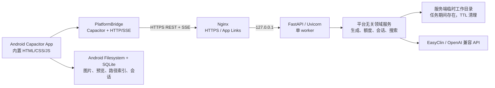

# Android 客户端与服务端迁移方案

> 状态：Android 分支、Capacitor 工程和无状态服务已创建；服务已部署到目标服务器并完成 HTTPS 联调、真实 EasyClin 生图/资源下载校验、release APK 签名和 App Links 文件部署。真机安装验收仍待完成。
>
> 基线：以 `imagen-v1.1.3`（`bf17b88`）为迁移起点；`imagen` 桌面分支继续独立维护，不在本方案中移除 Windows 功能。
>
> 架构决策（2026-08-21）：服务端不使用 SQLite 持久化业务数据，也不保存用户图片或会话；Android 端使用 Capacitor Filesystem 保存文件，使用本地 SQLite 仅记录资源路径、资源 ID、会话和任务索引。

## 当前验收记录（2026-08-21）

- 生产 API：`https://clife.djyx.me/easyapitool-api/`，`easyapitool.service` 仅监听 `127.0.0.1:8765`，经宝塔 Nginx HTTPS 代理；证书由 Let's Encrypt 签发，有效至 2026-11-19。
- HTTP API、Capacitor CORS、SSE、上传、短期资源下载和公网 HTTPS 真实 EasyClin 生图均已通过；真实生成结果已完成受认证下载和图像解码校验。
- Release 包名：`cn.easyapitool.mobile`。release APK/AAB 使用工作区外 keystore 签名；证书 SHA-256：`32:6A:8A:CE:34:0D:36:82:68:B0:9B:1C:B4:FE:B3:B5:97:8B:67:DD:AB:58:E9:7A:A4:CD:AE:99:2F:35:FC:14`。
- `https://clife.djyx.me/.well-known/assetlinks.json` 已返回匹配上述 release 签名的 JSON；release APK 清单已包含 `https://clife.djyx.me/app...` 的 `autoVerify` 意图。
- Android 首次连接可在服务设置中输入 HTTPS 服务地址和一次性配对码；服务器管理员运行 `/usr/local/sbin/easyapitool-pair` 生成码。配对码在 `/run/easyapitool` 中以 `0600` 保存、成功交换后立即删除，App 将令牌写入 Android Keystore。
- 设备接入后，从仓库根目录执行 `./deploy/verify-android-device.ps1`；脚本将安装签名 release APK、启动 Activity、检查 App Links 并测试 HTTPS 深链接。
- 本机已通过 216 项 Python 回归和离线 release APK/AAB 构建；一次性配对的服务方法、HTTP 路由与生产 HTTPS 消费均已验证。设备侧最终验收仍被硬件环境阻断：`adb devices`、`adb mdns services` 和 Emulator AVD 均为空，SDK 未安装 system image。
- `tests.test_app` 已单独重跑并通过全部 179 项；先前续作生成、持久化图片和流式日志的失败已由可注入图片目录解析修复。
- 已检查本机 USB、WSA、Windows Appx、Hyper-V、ADB 本地端点、无线 ADB、Emulator AVD 和 SDK 系统镜像：现有 USB 设备仅暴露 HID 接口，WSA 服务无已安装 Appx 运行时，且没有可启动 Android 目标。未连接真机或不安装系统镜像时，APK 安装、`pm get-app-links` 与相册/手势系统验收无法执行。
- 已在浏览器触摸横屏 viewport（`740x360`）模拟 Android 平台：页面固定 `--page-zoom: 1`、`width-wide height-full`、310px/430px 双列无重叠，标题栏隐藏，76 个 Lucide SVG 均已渲染且无未解析图标，tap highlight 透明；图片查看器已注册 Pointer Events 并使用 `touch-action: none`。这些结果覆盖 Web 层布局/触控，不替代真实 Android 系统服务验收。
- `tests.test_app` 已于最终验收阶段再次独立运行，179 项全部通过；早期的 `8 failures / 4 errors` 是已修复历史结果。Android Digital Asset Links 公共验证端点从本机和生产服务器均连接超时，但生产域名的有效 TLS、`assetlinks.json` 内容类型、包名和 release SHA-256 指纹已直接验证。
- release APK 已由 Android 构建工具解析：包名 `cn.easyapitool.mobile`、最小 SDK 24、目标 SDK 36、横屏 Activity、`autoVerify` App Links 均存在；ZIP 校验确认 APK 内含首页、Android 桥接、Lucide、样式和一次性配对 UI。`https://clife.djyx.me/app/pair` 已提供未安装 App 时的 HTTPS 网页回退页。
- 最终 Android 运行目标诊断：`adb_devices=0`、`adb_mdns_services=0`、`avds=0`、`system_images_directory=False`，`adb get-state` 返回 `no devices/emulators found`。设备验收脚本与 release APK 已准备好，待真实 Android OS 目标出现后执行。
- `app:connectedDebugAndroidTest --offline` 已尝试，但在设备发现前被未缓存的 `androidx.test.ext:junit:1.3.0` 和 `androidx.test.espresso:espresso-core:3.7.0` 阻断；按不下载依赖约束未安装。release APK/AAB 构建、签名、清单和内置资源验收均独立通过。

## 独立 IMGGEN 发布通道（2026-08-22）

- Android 生产服务已独立迁移到 `https://imggen.djyx.me/v1`；不继承 CLife 的站点目录、Nginx 路径或 systemd 服务。新服务运行于 `/opt/imggen-api`、`imggen-api.service` 和本地 `127.0.0.1:8766`，旧 `easyapitool.service` 仍保持在 `127.0.0.1:8765`。
- 新域名已完成 DNS、Let's Encrypt TLS、HSTS、落地页、`assetlinks.json` 和 `/v1/* -> /api/v1/*` 反向代理；未授权 `/v1/state` 返回 `401`，旧 `/easyapitool-api/state` 在新域名返回 `404`。
- Android release `versionName=1.1.0`、`versionCode=2`，发布清单包含实际 APK `buildTimestampMs`、大小和 SHA-256。服务端公开提供 `GET /v1/app/update` 检查更新与 `GET /v1/app/update/download?platform=android` 下载更新；服务端和 Android 原生插件均在安装前校验大小与 SHA-256。
- Android 自动更新已移除 GitHub 依赖：桥接层固定访问 `imggen.djyx.me/v1`，原生 Java 插件读取当前 `versionCode/buildTimestampMs`、下载 APK，并通过 Android 系统安装器交给用户确认；公开版本检查不携带设备令牌。
- 独立配对命令为 `/usr/local/sbin/imggen-api-pair`，配对文件位于 `/run/imggen-api/pairing-code`。真实线上验收已通过：配对成功、授权状态成功、配对码重放返回 `401`、同版本 `available=false`、APK 下载 `200` 且 SHA-256 匹配。
- 本地最终回归为 `219` 项通过、`1` 项 Windows 预期跳过；Android 真机安装、`pm get-app-links` 和系统安装器确认仍需真实 Android OS 设备或 AVD，此项不由服务器发布通道替代。

## 文档结构

本文按以下顺序定义迁移工作：

1. **阶段总览**：每个阶段的开发目标、交付物和可勾选验收标准。
2. **已确认事实与边界**：基于当前仓库、本机 Android 工具链和目标服务器的实际情况作出的约束。
3. **目标架构与安全决策**：Python 服务端、Capacitor Android 壳、鉴权、存储、HTTP/HTTPS 与 App Links 的边界。
4. **接口与前端迁移设计**：桌面 `pywebview` 桥如何替换为 HTTP/SSE，以及图片和移动交互的实现方式。
5. **部署、构建和连通性测试**：从服务器部署到真机验证的可执行流程。
6. **风险、决策门与不在范围内的事项**：必须由实施前确认的条件，避免把临时测试方案当成生产方案。

## 阶段总览与验收任务框

### 阶段 0：迁移基线与安全前置条件

**开发目标**：创建独立开发线，冻结桌面版本基线，确定生产域名、TLS、Android 签名身份和服务端密钥策略。

- [x] 从 `imagen-v1.1.3` 创建 `android` 分支，不修改或重写 `imagen` 的桌面发布历史。
- [ ] 记录 Android `applicationId`、签名证书指纹、版本号规则和 Play/侧载发布方式。
- [ ] 确定一个可解析到 `39.105.74.222` 的生产域名，并准备 DNS 管理权限。
- [x] 为生产域名签发有效 TLS 证书；确认 `/.well-known/assetlinks.json` 可通过公网 HTTPS 访问。
- [x] 明确服务是单用户私有部署还是多用户服务；本方案默认先实现单用户、设备配对模式。
- [x] 确定 Android Keystore/安全存储中的 API Key 与设备 Token 方案；服务端不持久化这些凭据。

**验收标准**：

- [x] `git branch --show-current` 为 `android`，且分支起点可追溯到 `imagen-v1.1.3`。
- [x] 文档中记录了应用包名、签名 SHA-256 指纹和生产域名。
- [x] 生产域名的 `https://<domain>/.well-known/assetlinks.json` 返回正确 JSON 与有效证书链。
- [x] API Key、设备 Token 不在 Git、APK、App Links URL、服务端磁盘、日志或 shell 历史中出现。
- [x] 服务端不持有长期业务密钥；客户端凭据只在 Android 安全存储中存在。

### 阶段 1：抽离平台无关 Python 领域层

**开发目标**：把现有桌面控制器中与窗口、系统托盘、Windows 文件系统和命名管道无关的业务能力抽出，使其可由 HTTP 服务调用。

- [ ] 将图片生成、提示词润色、额度查询、图片会话、任务取消、搜索和持久化流程抽为平台无关服务。
- [ ] 分离 Windows 专属模块：DPAPI、系统托盘、通知、窗口控制、`AF_PIPE`、PowerShell 更新与本地文件选择器。
- [x] 将服务端改为无状态/临时工作目录模式，不引入服务端 SQLite、用户会话数据库或持久化 API Key。
- [ ] 保持桌面端经适配层继续调用同一领域服务，避免复制两套图片生成逻辑。
- [x] 为领域层补充无需 pywebview/Win32 的单元测试。

**验收标准**：

- [x] Linux 环境可导入领域服务，不触发 `ctypes.windll`、`AF_PIPE`、WebView2 或系统托盘导入。
- [ ] 现有 `tests.test_app` 中与图片生成、会话、额度有关的测试在桌面兼容层下仍通过。
- [ ] 同一请求输入在桌面适配层和服务端适配层生成一致的任务参数与持久化结构。

### 阶段 2：实现受认证的 HTTP API 与事件流

**开发目标**：用 REST API 和可恢复的 SSE 事件流替换 `window.pywebview.api`，并防止服务器文件路径或秘钥泄漏给客户端。

- [x] 新建 Python ASGI 服务入口，默认采用 FastAPI + Uvicorn，单 worker 起步。
- [x] 实现版本化接口 `/api/v1/...`、健康检查、认证、任务事件流和图片二进制下载接口。
- [x] 将生成任务改为“创建任务后返回 `requestId`”，前端通过 SSE 获取过程事件并可重连恢复。
- [x] 用不透明的资源 ID 替代 `source_path`、Windows 本地绝对路径和数据目录名称。
- [ ] 实现上传大小、文件类型、图片尺寸、任务所有权和请求频率限制。
- [ ] 实现服务端审计日志和结构化错误，但屏蔽 API Key、Bearer Token、图片二进制和用户提示词中的敏感字段。

**验收标准**：

- [x] 未认证请求返回 `401`；其他设备的资源 ID 返回 `403` 或 `404`。
- [x] `GET /healthz` 仅证明进程存活，`GET /readyz` 同时验证数据库、配置和工作目录可用。
- [ ] 图片生成事件在客户端断线后可按事件序号续接，最终结果也可通过会话查询恢复。
- [ ] API 响应和 SSE 事件中不存在服务器绝对路径、Windows 路径、DPAPI 密文或原始 API Key；文件只通过短期资源 ID 下载。
- [x] API 集成 smoke test 已覆盖健康、鉴权失败、CORS、上传、下载和 SSE；使用临时内存 EasyClin Key 已完成真实生图、短期资源下载和图像解码校验。

### 阶段 3：Capacitor Android 壳与移动桥接

**开发目标**：将复用后的 HTML/CSS/JS 打入 APK，并让前端通过统一桥接层在桌面、浏览器调试和 Android App 中工作。

- [x] 在仓库内新建独立 `mobile/` Capacitor 工程，静态前端资源由 APK 内置，不通过远程 `server.url` 加载页面。
- [ ] 在 `mobile/` 锁定 Capacitor、Android Gradle Plugin 和 Gradle Wrapper 版本；复用 `D:\ANDROID\clife-android-env.ps1` 的 JDK、SDK 和 Gradle 缓存。
- [ ] 创建 `PlatformBridge`，将现有直接 `window.pywebview.api` 调用逐步替换为 `bridge.call()`。
- [ ] 实现三个运行时适配器：桌面 pywebview、HTTP/SSE 浏览器调试、Capacitor Android。
- [ ] 采用 Capacitor `App`、`Preferences`、`StatusBar`、`Keyboard`、`Filesystem`、`Share`、SQLite 插件和相册选择能力；新增插件前先确认当前 Capacitor 主版本兼容性。
- [x] 在 Android `MainActivity` 固定 `screenOrientation="landscape"`，并为安全区、软键盘和系统栏配置移动样式。

**验收标准**：

- [x] 本机使用已有依赖和缓存完成 Capacitor 资源同步及 Gradle `--offline` Debug APK 构建；未执行联网安装。
- [ ] APK 首屏来自 APK 内置静态资源，离线打开可显示本地界面与本地会话索引，不依赖远程 HTML 或服务端数据库。
- [ ] 横竖屏旋转时应用始终保持横屏；Activity 重建后草稿、登录态和未完成任务引用可恢复。
- [ ] 桌面构建不因 Android 适配而失去现有 pywebview 功能。

### 阶段 4：手机交互、媒体和性能适配

**开发目标**：把桌面窗口交互转换为横屏手机可用的触屏体验，完善相册导入、图片下载/查看和系统栏表现。

- [x] 移除 Android 端标题栏、窗口拖拽、缩放、置顶、托盘、桌面自动启动和 EXE 更新相关 UI/逻辑。
- [ ] 使用安全区布局、最小 44 dp 触控目标、横屏双栏或抽屉式布局，避免桌面控件在小屏横向堆叠。
- [ ] 增加从 Android 相册多选参考图，最多 16 张；保留文件类型、数量和服务端校验。
- [ ] 上传前在客户端按需缩放和压缩大图，使用 `Blob`/对象 URL，禁止将多张大图长期转为 base64 留在 JS 内存。
- [ ] 实现触屏图片查看器：双指缩放、双击缩放/复位、拖动平移、缩放为 1 时左右切换、下拉或关闭按钮退出。
- [ ] 实现图片下载到 Android MediaStore 的 Pictures/Downloads，并提供保存成功反馈；`Share` 作为设备兼容回退。
- [ ] 对高级模型矩阵和拖动控件实现 Pointer Events 触控路径，防止滚动手势与选择手势互相抢占。
- [ ] 优化状态栏、导航栏和本地通知色彩：深色 UI 使用一致的状态栏背景与浅色图标，并按 Android 版本正确处理通知权限。
- [ ] 对图片卡片、历史会话和 SSE 事件进行懒加载、节流与批量渲染，限制不可见内容的图像解码和动画。

**验收标准**：

- [ ] 所有 Android 页面均无桌面标题栏及窗口控制按钮，且不会调用桌面专属 API。
- [ ] 真机可从相册选择多张图片、预览、取消、上传、生成并继续编辑。
- [ ] 真机可双指缩放图片，单指平移不会触发页面误滚动；缩放为 1 时才允许左右翻页。
- [ ] 下载结果出现在系统 Pictures 或 Downloads 中，文件可被其他图库应用读取。
- [ ] 在约 6 GB RAM 的中端 Android 设备连续查看历史图片并生成任务时，没有明显页面重载、白屏或持续内存增长。
- [ ] 横屏安全区、软键盘、状态栏和导航栏不遮挡提示词输入、生成按钮和图片操作。

### 阶段 5：部署、HTTPS/App Links、真机连通性与发布

**开发目标**：把服务安全部署至 `root@39.105.74.222`，完成 HTTPS、Android App Links、真实网络和 APK 安装验证。

- [x] 在服务器创建非 root 的 `easyapitool` 系统用户、临时工作目录、Python 虚拟环境和 systemd 服务。
- [x] 使用 Nginx 反向代理本机 `127.0.0.1` ASGI 服务，启用 TLS、HSTS、请求体上限、SSE 反向代理配置和访问日志脱敏；服务端不配置业务 SQLite。
- [ ] 配置服务器防火墙/云安全组，只对公网开放必要的 `80`/`443`；服务端口不直接暴露。
- [x] 配置 Android App Links `assetlinks.json`，写入最终 release 签名 SHA-256，而非 debug 签名。
- [ ] 构建已签名 release APK/AAB，安装到真机，验证通过蜂窝数据和 Wi-Fi 访问服务；已完成签名 release APK、HTTPS App Links 和公网真实生图/下载校验，待连接真机或可用 AVD。
- [ ] 完成端到端图片生成、取消、重连、相册上传、下载到 Android 文件系统、深链接和应用前后台切换测试；服务器生成、上传、下载和 SSE 已通过，仍待真机与 HTTPS 验收。

**验收标准**：

- [x] `systemctl status easyapitool` 为 active，服务重启后能自动恢复。
- [x] `nginx -t` 成功，Nginx 为 active，`curl https://<domain>/healthz` 返回预期状态。
- [x] 公网无法访问 Uvicorn 监听端口；未带认证的 API 请求被拒绝。
- [ ] `adb shell pm get-app-links <applicationId>` 显示指定域名为 verified；当前未连接真机、无 AVD 且 SDK 未安装系统镜像。
- [ ] 从浏览器点击 `https://<domain>/...` 可直接进入已安装 App；未安装时正常打开网页回退页；当前未连接真机、无 AVD 且 SDK 未安装系统镜像。
- [ ] 真机通过 Wi-Fi 和蜂窝网络均能完成一次真实生成和下载，SSE 重连后不丢失最终任务状态；当前未连接真机、无 AVD 且 SDK 未安装系统镜像。

## 已确认事实与约束

### 当前桌面实现

- 桌面入口使用 Python 3.12、`pywebview` 和 Edge WebView2；窗口从本地 `file:` 静态页面启动。
- 后台主进程与 UI 子进程通过 Windows `AF_PIPE` 命名管道 RPC 通信。
- Windows 专属能力包括 DPAPI 密钥加密、系统托盘、Windows 通知、窗口尺寸/置顶/拖拽、PowerShell 自更新、剪贴板和本地文件选择。
- 前端当前存在大量 `window.pywebview.api` 调用，涵盖状态读取、密钥、图片上传、生成、任务取消、图片读取/导出、窗口和更新设置。
- 图片会话、生成目录和数据库当前按 Windows 用户目录设计；移动端迁移后会话文件和索引迁移到 Android 本地。

### 本机 Android 构建环境

- `D:\ANDROID\clife-android-env.ps1` 可复用 JDK、Android SDK 路径和 Gradle 缓存设置。
- 已确认本机具备 JDK 21、Android SDK、Node.js `v22.22.2`、npm `10.9.7` 与 ADB。
- `D:\ANDROID` 目前没有可复用的 Capacitor 项目、Android 工程或已安装的 Capacitor npm 依赖；实施时需要在仓库 `mobile/` 中新建并锁定工程依赖。
- 当前 `adb devices` 没有连接真机。可先使用模拟器做基础构建验证，但相册、横屏、手势、下载和网络切换验收必须连接真实 Android 设备。

### 目标服务器现状

- 目标地址为 `root@39.105.74.222`，已确认可通过免密 SSH 登录。
- 系统为 Ubuntu 24.04 系列，提供 Python 3.12.3。
- 服务器端口 `80` 已有进程监听，但 `systemctl is-active nginx` 当前为 `inactive`；实施前必须先识别该端口实际所有者，不能直接覆盖现有站点。
- 未在常见 Let’s Encrypt 和面板证书目录中发现可复用 `fullchain.pem`；当前未确认生产域名和有效 TLS 证书。

## 目标架构



### 分层原则

1. **领域层**：图片任务、提示词润色、用量刷新、会话树、搜索编排和数据模型。此层不读取浏览器对象、不创建窗口、不依赖 Win32。
2. **桌面适配层**：保留 `pywebview`、Windows 文件选择、托盘、DPAPI 和 EXE 更新能力，只调用领域层。
3. **服务端适配层**：FastAPI 路由、身份验证、上传解析、SSE、资源授权、服务器任务生命周期和 Linux 存储。
4. **前端桥接层**：唯一允许接触运行平台的前端模块。业务 UI 不再直接引用 `window.pywebview.api`。
5. **Android 原生层**：负责相册、下载、分享、安全存储、状态栏/导航栏、App Links 和应用生命周期；不复制 Python 业务逻辑。

### 服务端进程模型

- 初期采用一个 Uvicorn worker，限制内存和生成并发；服务端任务状态只存在内存与可清理临时目录。
- 后台任务结果通过 SSE 和受认证的短期资源下载接口发送到 Android；客户端收到后写入 Filesystem，并在本地 SQLite 建立索引。
- 服务重启会使未完成服务端任务失效；Android 根据本地任务索引将其标记为中断，不把服务端临时文件当成历史数据。
- Uvicorn 只监听 `127.0.0.1:<private-port>`；公网入口必须由 Nginx 统一承载。
- 临时任务目录建议为 `/run/easyapitool` 或 `/tmp/easyapitool`，日志为 `/var/log/easyapitool`，服务配置为 `/etc/easyapitool/easyapitool.env`；不得创建业务 SQLite 或持久化用户图片目录。

## HTTP、HTTPS 与 Android App Links 决策

### 开发期 HTTP

用户要求 HTTP 连通性测试时，可仅在 **debug 构建** 中允许指定测试地址，例如 `http://39.105.74.222:<test-port>`。该路径必须满足：

- 仅用于短期联调，Android `network_security_config` 只对白名单测试主机启用 cleartext。
- Debug APK 明确标识为测试版，不能签发或发布为正式安装包。
- HTTP 期间不得传输长期 API Key、生产会话 Token 或真实隐私图片；可使用临时测试账户和可撤销 Token。
- 测试完成后删除或禁用 cleartext 配置；release 变体必须拒绝明文 HTTP。

### 生产 HTTPS

- 正式 API 只允许 `https://api.<domain>` 或确定的 HTTPS 域名。
- Nginx 负责证书、HTTP 到 HTTPS 跳转、HSTS、请求体限制、SSE 禁用缓冲和基础限流。
- Android release 网络安全配置禁止 cleartext；所有登录、图片上传、下载和 SSE 使用 TLS。

### App Links

Android **Verified App Links 不能使用纯 IP 或 HTTP**。其前提是可验证的 HTTPS 域名和下列资源：

```text
https://<domain>/.well-known/assetlinks.json
```

文件必须包含最终 release APK 签名证书 SHA-256 与 Android 包名。实现分两层：

- `easyapitool://...`：自定义 Scheme，用于本地开发或受控场景，不属于系统验证的 App Links。
- `https://<domain>/app/...`：正式 Android App Links；安装 App 时直接打开应用，未安装时进入安全网页回退页。

App Links 中只允许传递非敏感路由参数，例如打开某个图片会话或配对页面；不得把 API Key、访问 Token、服务器主密钥或可长期使用的下载 URL 放入链接。

## 鉴权、密钥和数据迁移

### 密钥策略

桌面版的 DPAPI 仅绑定 Windows 用户，不能在 Linux 服务器复用。移动版采用客户端持有凭据、服务端内存使用的策略：

- Android 使用 Android Keystore/安全存储插件保存提供商 API Key、设备 Token 和刷新 Token；SQLite 只保存 keyId、昵称、base URL 等非秘密元数据。
- 服务端通过 HTTPS 接收短期请求凭据或设备 Token，在内存中使用，不写入数据库、配置文件、任务 manifest 或日志。
- 服务端临时工作目录只保存任务执行所需的短期文件，任务完成、取消、超时或进程退出后清理。
- 初版采用单用户、设备配对：新设备用一次性配对码或 QR 码换取设备凭据，配对码短时有效且只能使用一次。
- 所有 API 以设备/用户身份进行资源隔离；即使初版只有一个实际使用者，也按多设备边界设计。

### 数据目录与备份

- Android Filesystem 保存原图、缩略图、搜索参考图和会话 manifest；本地 SQLite 记录 `assetId`、本地路径、会话/轮次、任务状态、尺寸和时间戳。
- 服务端只用资源 ID 和内存映射关联临时文件，不向客户端返回真实路径；客户端下载完成后立即写入本地并可通知服务端清理。
- Android 负责本地保留周期、删除、孤儿文件清理和 SQLite 路径修复；服务端负责临时目录 TTL 和磁盘水位清理。

## HTTP API 与事件流草案

所有业务接口统一在 `/api/v1` 下，除健康检查外都要求 Bearer Token。具体字段在实施时用 OpenAPI/Pydantic 模型冻结。

| 现有桌面能力 | 服务端接口草案 | 说明 |
| --- | --- | --- |
| `get_state` | `GET /api/v1/state` | 返回安全的用户状态与设置，不回传秘钥。 |
| 添加/删除密钥 | `POST/DELETE /api/v1/keys` | 仅接收时使用明文，持久化前立即加密。 |
| 刷新额度 | `POST /api/v1/usage/refresh` | 返回任务或最新状态。 |
| 导入参考图 | `POST /api/v1/uploads/references` | `multipart/form-data`，返回临时资源 ID。 |
| 生成图片 | `POST /api/v1/image-generations` | 返回 `requestId`、`setId` 和初始状态。 |
| 取消任务 | `POST /api/v1/image-generations/{requestId}/cancel` | 幂等取消。 |
| 图片会话 | 客户端 SQLite | 服务端不保存历史会话；Android 从本地 Filesystem/SQLite 恢复。 |
| 图片二进制 | `GET /api/v1/assets/{assetId}` | 仅访问任务期间的临时资源；下载后由 Android 写入 Filesystem。 |
| 提示词润色 | `POST /api/v1/prompts/polish` | 返回任务 ID 或 SSE 关联 ID。 |
| 任务事件 | `GET /api/v1/events?cursor=<id>` | SSE，支持 `Last-Event-ID`/游标重连。 |
| 健康状态 | `GET /healthz`、`GET /readyz` | 不泄露配置或敏感状态。 |

以下桌面能力不应暴露为移动端 API：窗口拖拽、窗口尺寸、置顶、系统托盘、Windows 开机启动、PowerShell 自更新、打开本机图片目录、桌面开发者工具和 DPAPI 操作。

## 前端迁移与 Android 交互设计

### 统一桥接层

新增前端接口示意：

```javascript
const bridge = window.platformBridge;

const state = await bridge.getState();
const task = await bridge.generateImage(payload);
bridge.subscribeEvents({ cursor, onEvent, onReconnect });
```

适配器职责：

- **DesktopBridge**：暂时转发到 `window.pywebview.api`，保持现有 EXE 行为。
- **HttpBridge**：封装 `fetch`、认证头、上传、超时、错误映射和 SSE 重连，供浏览器调试与 Android 共用。
- **CapacitorBridge**：在 `HttpBridge` 之上调用相册、下载、分享、状态栏、键盘和深链接原生能力。

业务模块必须迁移为只依赖 `platformBridge`。迁移过程中不允许一部分代码继续直接调 pywebview、另一部分改 HTTP，否则会造成错误处理、认证和移动环境行为不一致。

### Android 端标题栏与设置裁剪

在 `<html>` 或根容器上设置 `data-platform="android"`，以平台能力开关控制 UI，而不是通过 User-Agent 猜测：

- 隐藏自绘标题栏、最小化/最大化/关闭、窗口拖拽/调整大小、始终置顶。
- 隐藏关闭行为、背景 UI 模式、Windows 开机启动、桌面更新、打开图片目录和开发者工具设置。
- 保留与服务真实相关的额度阈值、刷新、API Key、图片设置、模型矩阵、会话和生成能力。
- 使用 `viewport-fit=cover` 与 `env(safe-area-inset-*)` 处理刘海、挖孔和横屏手势区域。

### 横屏布局

- Android `MainActivity` 固定 `screenOrientation="landscape"`；若希望允许左右倒转，改用 `sensorLandscape`，但两者只能在产品确认后选其一。
- 以最小横屏宽度约 640 CSS px 设计：左侧为提示词/参数，右侧为任务与图片；窄横屏时右侧改为可滑出的任务抽屉。
- 关键操作保持至少 44 dp 的触控尺寸，避免把紧凑桌面图标直接缩小到手机。
- 软键盘打开时监听 Capacitor Keyboard 事件并收缩/滚动输入区域，不移动系统栏或遮盖生成按钮。

### 相册上传

- 首选 Capacitor 相册多选能力，最多选择 16 张；若插件在目标 Capacitor 版本中无法稳定多选，使用 Android 原生 `ACTION_OPEN_DOCUMENT` 的小型 Capacitor 插件。
- 保留 HTML 文件输入作为 Web 浏览器开发回退，但 Android App 不依赖其厂商差异行为。
- 客户端检查 MIME、像素数和单张大小；大图片先在 Worker/`createImageBitmap` 中缩放至约 2048 px 长边并压缩，再上传 Blob。
- 预览一律使用对象 URL；上传完成、删除或页面卸载时调用 `URL.revokeObjectURL()`。
- 服务端再次验证内容类型、解码安全性、数量、尺寸和总请求体大小，客户端校验不是安全边界。

### 图片查看与下载

- 查看器只在图片覆盖层使用 Pointer Events：双指 pinch 缩放、单指平移、双击切换缩放级别、缩放归零时左右切换。
- 使用 `touch-action`、局部 `preventDefault()` 和手势状态机，避免在整个页面关闭滚动或造成点击延迟。
- 图片 API 用资源 ID 提供受控二进制流；带认证的图片优先 `fetch` 成 Blob，再创建短生命周期对象 URL，避免 `` 无法携带 Authorization 头的问题。
- 下载通过 Android MediaStore 写入 Pictures/Downloads，使用原生桥接避免旧式外部存储权限；不能写入时回退到 Capacitor Share。
- 用户可见的下载、保存、删除和取消必须有成功/失败反馈，并且不会把服务器路径显示在界面中。

### 系统栏、通知和生命周期

- 使用 Capacitor `StatusBar` 与 Android 主题统一状态栏和导航栏颜色，深色页面使用高对比图标；沉浸式覆盖模式必须逐机验证安全区。
- 若启用本地通知，使用 Android 通知 channel、小图标和品牌色；Android 13+ 在需要时请求 `POST_NOTIFICATIONS`，拒绝权限不阻断生成任务。
- 使用 Capacitor `App` 的前后台事件：前台恢复时拉取状态并从 SSE 游标续接；后台时停止前端动画和高频重绘，但服务端任务继续运行。

### 性能规则

- 静态 HTML/CSS/JS 内置到 APK，避免启动时下载前端资源；生产 CSS/JS 去除 source map 和开发调试代码。
- SSE 事件先写入轻量状态队列，以 `requestAnimationFrame` 或约 100--250 ms 批次提交 UI，避免每个 token/partial 事件全量重绘。
- 历史图片采用分页、缩略图、`loading="lazy"`/IntersectionObserver 和可见区域解码；不加载全部原图。
- 任务列表与图片卡片达到阈值后使用窗口化渲染或至少限制 DOM 节点数，避免长会话占满 WebView 内存。
- 只在图片查看器开启时启用高成本手势监听、滤镜和动画，关闭时释放对象 URL、事件监听和 `will-change`。

## 服务端部署设计

### 目录与权限

```text
/opt/easyapitool/                 # Git checkout 或部署包，只读代码
/opt/easyapitool/.venv/           # Python 虚拟环境
/etc/easyapitool/easyapitool.env  # 0600，服务端密钥与运行配置
/run/easyapitool/                 # 临时图片与任务工作目录，重启可清理
/var/log/easyapitool/             # 应用日志
```

- 使用 `easyapitool` 专用系统用户运行服务，不以 `root` 运行 Python。
- 由 root 通过 systemd 管理服务、日志轮转和目录权限；日常应用进程只访问自己的数据目录。
- 服务器 SSH 根登录仅用于初始布署；后续部署应使用受限用户或明确的部署脚本。

### systemd 与 Nginx

`easyapitool.service` 的核心约束：

- `ExecStart` 使用虚拟环境中的 Uvicorn，绑定 `127.0.0.1:<private-port>`。
- 设置 `Restart=on-failure`、合理启动超时、受限写入路径和环境文件读取权限。
- 先以单 worker 运行；任务状态和临时资源只在内存/运行目录中存在，不引入服务端数据库。

Nginx 的核心约束：

- 部署前确认谁占用 `80` 端口以及实际网站管理方式；当前 Nginx 服务 inactive，不能假定它是现有监听者。
- `/api/` 代理到回环 Uvicorn，SSE 路由设置 `proxy_buffering off`、长读超时和正确的 `X-Forwarded-*` 头。
- 上传路由单独限制 `client_max_body_size` 与速率；静态 App Links 文件可由 Nginx 直接托管。
- TLS 就绪后将 HTTP 强制重定向到 HTTPS，生产 API 不接受 cleartext。

## 构建与发布设计

### Capacitor 项目

建议目录：

```text
mobile/
  package.json
  capacitor.config.ts
  web/
    index.html
    scripts/
    styles/
  android/
  scripts/
```

实现时应避免维护两份手工拷贝前端：通过构建脚本将共享 `frontend/` 输出同步到 `mobile/web/`，或将共享资源抽至明确的 `web/` 源目录，再由桌面和 Capacitor 消费。

### Android 签名与版本

- Debug 和 release 使用不同签名；`assetlinks.json` 只能写 release 签名指纹。
- 签名密钥放在工作区外且不提交；CI/本机构建从受限环境变量或安全密钥库读取。
- `versionCode` 单调递增，`versionName` 与服务端 API 兼容性策略一致。
- 初版以可审计的 APK 侧载发布为主；若进入 Play Store，再补充 AAB、隐私披露、数据安全表单与商店签名流程。

## 连通性测试计划

### 服务端本机测试

- [ ] 在服务器执行 `curl -fsS http://127.0.0.1:<private-port>/healthz`。
- [ ] 执行就绪检查，验证临时目录和配置加载，不回显秘钥或数据库状态。
- [ ] 用测试 Token 调用状态接口、上传一张小测试图、创建生成任务、订阅 SSE、下载结果到 Android Filesystem、取消任务并查询最终状态。
- [ ] 未带 Token、错误 Token、越权资源 ID、超尺寸文件和错误 MIME 分别返回预期错误码。
- [ ] 重启 systemd 服务后，确认服务端临时任务失效且 Android 本地已下载的历史图片/SQLite 索引仍可离线读取。

### 公网与 HTTPS 测试

- [ ] 识别 80 端口既有进程后部署反向代理，执行 `nginx -t` 和 `systemctl reload`。
- [ ] 从本机和外网执行 `curl -I https://<domain>/healthz`，验证证书、HTTPS 跳转和安全响应头。
- [ ] 确认私有 Uvicorn 端口不能从公网连接。
- [ ] 使用 SSE 客户端持续监听超过 60 秒，验证代理不会缓冲或提前断开事件。
- [ ] 在 Debug APK 中仅对受控地址验证 HTTP 联通；Release APK 必须对 HTTP 失败且对 HTTPS 成功。

### Android 真机测试

前提：连接真实 Android 设备并使 `adb devices -l` 显示 `device`，记录型号、Android 版本、屏幕尺寸和网络环境。

- [ ] 安装 Debug APK，确认固定横屏、冷启动、前后台切换和离线错误页。
- [ ] 用 Wi-Fi 完成登录/配对、额度刷新、相册多选、图片上传、真实生成、任务取消、SSE 重连、继续编辑和图片下载。
- [ ] 切换到蜂窝网络重复真实生成和下载，验证 DNS、TLS、超时和重连行为。
- [ ] 在相册选择高像素照片、多次打开/关闭查看器、滚动长历史会话时观察内存和 UI 响应。
- [ ] 验证状态栏/导航栏颜色、软键盘、安全区、通知权限拒绝、深链接进入和浏览器回退。
- [ ] 执行 `adb shell pm get-app-links <applicationId>`，确认 production 域名 verified。

## 风险、决策门和不在范围内事项

### 必须先确认的决策门

1. **生产域名与 TLS**：没有 HTTPS 域名就无法完成 Verified App Links，也不应传输真实 API Key 或图片。
2. **身份与密钥模型**：服务端不持久化 API Key；必须先落定 Android Keystore、设备 Token 生命周期和 HTTPS 传输策略。
3. **80 端口所有者**：当前端口已监听但 Nginx inactive；必须找出既有服务和管理面板后才调整反向代理。
4. **真实 Android 设备**：当前未连接 ADB 真机。模拟器不能替代相册、手势、系统栏、下载目录和蜂窝网络验收。
5. **容量与并发**：服务器资源有限，先完成单 worker、限流、磁盘水位和任务并发控制，再考虑高并发架构。

### 明确不做的事情

- 不将 Windows EXE、WebView2、系统托盘、DPAPI 或 `AF_PIPE` 直接移植到 Android/Linux。
- 不把服务端 API Key、长期访问 Token、主密钥或调试后门编译进 APK；API Key 只由 Android 安全存储提供给请求。
- 不在服务端创建 SQLite、用户图片库或历史会话数据库；服务端只维护内存任务和可清理临时文件。
- 不以 HTTP/IP 地址冒充 Android Verified App Links。
- 不在未确认 80/443 既有服务的情况下覆盖服务器站点配置。
- 不在没有真实设备测试的情况下宣布移动端相册、下载、手势和横屏体验验收完成。

## 建议实施顺序

完成阶段 0 的域名、签名和安全决策后，按“领域层抽离 -> API 合约和服务端测试 -> 前端桥接 -> Capacitor 壳 -> 移动交互 -> HTTPS/App Links/真机发布”推进。每个阶段只在其验收框全部满足后进入下一阶段；桌面 `imagen` 发布仍按原有 `imagen-v*` 通道独立进行。